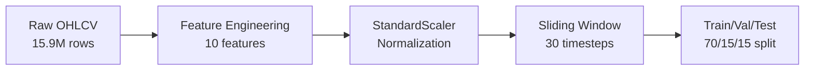
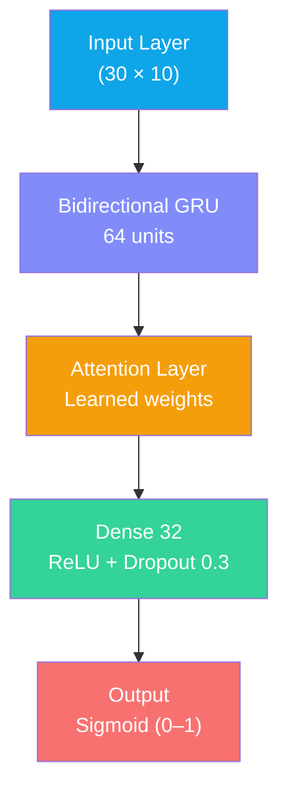
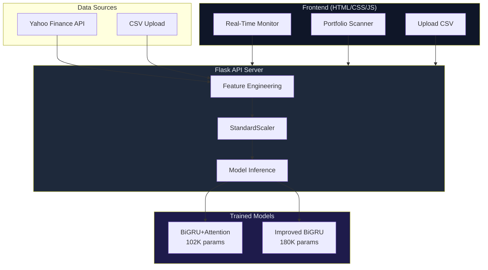

# FlashGuard: Real-Time Flash Crash Detection Using Deep Learning

> Presentation content for each slide. Transfer to your PPT tool of choice.

---

## Slide 1 — Title Slide

**Title:** FlashGuard: Real-Time Flash Crash Detection Using BiGRU + Attention Deep Learning

**Subtitle:** Predicting market microstructure anomalies in Indian equity markets using minute-level OHLCV data

---

## Slide 2 — Problem Statement

### What are Flash Crashes?
- **Sudden, extreme price drops** (5–15%) occurring within minutes, followed by rapid recovery
- Caused by algorithmic trading, HFT feedback loops, and market microstructure fragility
- **June 4, 2024:** NIFTY 50 dropped **~1,400 points** in 30 minutes during Indian election results
- **May 6, 2010:** US "Flash Crash" — Dow Jones fell **~1,000 points** in 5 minutes

### Why This Matters
- **₹5+ lakh crore** wiped from Indian markets in the June 2024 crash
- Individual investors suffer panic-driven losses
- Current surveillance systems are **reactive, not predictive**
- No real-time early warning system exists for retail investors

### The Gap
| Aspect | Current State | Our Solution |
|--------|--------------|--------------|
| Detection | Post-event analysis | **Pre-event prediction** |
| Data Level | Daily OHLCV | **Minute-level OHLCV** |
| Approach | Rule-based thresholds | **Deep learning (BiGRU + Attention)** |
| Accessibility | Institutional only | **Web dashboard for all** |

---

## Slide 3 — Objectives

1. **Build a deep learning model** capable of predicting flash crashes from minute-level OHLCV data before they fully materialize
2. **Train on 15.9 million** NIFTY minute-level data points spanning 10 years (2015–2025)
3. **Compare GRU vs LSTM** architectures and demonstrate BiGRU + Attention superiority
4. **Develop a real-time web dashboard** (FlashGuard) for live monitoring, portfolio scanning, and CSV-based backtesting
5. **Validate on real crash events** — June 4, 2024 Election crash, sectoral crashes (NIFTY Infra, Auto, Bank)
6. **Achieve >95% AUC** while maintaining sub-second inference time for real-time deployment

---

## Slide 4 — Methodology: Data Pipeline

### Dataset
- **Source:** NSE/NIFTY minute-level OHLCV data (2015–2025)
- **Volume:** 15.9 million rows across 27 NIFTY indices
- **Granularity:** 1-minute OHLCV bars
- **Crash labeling:** 30-minute rolling window, threshold = −2% return

### Feature Engineering (10 features)

| Feature | Formula | Purpose |
|---------|---------|---------|
| `return` | `Close.pct_change()` | Instantaneous price change |
| `log_return` | [log(Close / Close_prev)](file:///d:/flash%20crash/dashboard.py#622-631) | Normalized return |
| `volatility_5` | `return.rolling(5).std()` | Short-term volatility |
| `volatility_10` | `return.rolling(10).std()` | Medium-term volatility |
| `volatility_20` | `return.rolling(20).std()` | Long-term volatility |
| `momentum_5` | `Close.pct_change(5)` | 5-bar momentum |
| `momentum_10` | `Close.pct_change(10)` | 10-bar momentum |
| `high_low_spread` | [(High − Low) / Close](file:///d:/flash%20crash/quick_test.py#7-18) | Intrabar volatility |
| `open_close_return` | [(Close − Open) / Open](file:///d:/flash%20crash/quick_test.py#7-18) | Bar direction |
| `price_acceleration` | `return.diff()` | Rate of change of returns |



---

## Slide 5 — Methodology: Model Architecture

### BiGRU + Attention Architecture



**Why BiGRU + Attention?**
- **Bidirectional GRU:** Captures both forward and backward temporal patterns in price sequences
- **Attention Mechanism:** Learns to focus on the most critical timesteps (e.g., sudden volatility spikes) rather than treating all 30 timesteps equally
- **Gating mechanism:** GRU's update/reset gates handle the vanishing gradient problem better than vanilla RNN
- **Parameter efficiency:** 102,017 parameters — lightweight enough for real-time inference

### Training Strategy
- **Class imbalance handling:** SMOTE oversampling + focal loss (α=0.8994)
- **Optimizer:** Adam with learning rate scheduling
- **Early stopping:** Patience=10, monitoring validation AUC
- **Epochs:** 27 (early-stopped from max 100)

---

## Slide 6 — Methodology: System Architecture

### End-to-End System Design



---

## Slide 7 — GRU vs LSTM Comparison

> **Key finding:** GRU outperforms LSTM for flash crash detection

| Metric | GRU Model | LSTM Model |
|--------|-----------|------------|
| **AUC** | **0.990** | 0.959 |
| **Accuracy** | **79.4%** | 63.5% |
| **Parameters** | **91,969** | 120,897 |
| **Training Time** | **213 min** | 287 min |
| **Crashes Detected** | **15/15 (100%)** | 15/15 (100%) |
| **False Alarms** | **116,936** | 76,272 |

**Why GRU wins:**
- 23.9% fewer parameters → faster inference
- Higher accuracy with comparable recall
- Better suited for minute-level temporal patterns where long-term memory is less critical

---

## Slide 8 — Working Prototype: FlashGuard Dashboard

### Real-Time Monitor
> Live prediction for any NSE stock — enter a ticker, get instant crash risk assessment


**Features:**
- Risk ring with gradient visualization (green → amber → red)
- Live price data from Yahoo Finance API
- Auto-refresh every 60 seconds
- Multiple data intervals (1m, 5m, 15m, 1h, 1d)

---

### Portfolio Scanner
> Scan multiple stocks simultaneously — color-coded risk comparison


**Features:**
- Batch scanning of 8+ tickers
- Sorted by risk level
- Bar chart risk distribution
- Band classification (STABLE / ELEVATED / HIGH RISK)

---

### Upload CSV Analysis
> Upload any OHLCV CSV file for offline crash detection


**Features:**
- Drag-and-drop CSV upload
- Feature snapshot visualization
- Works with historical crash data

---

## Slide 9 — Engineering Tools / Technology Stack

| Layer | Technology | Purpose |
|-------|-----------|---------|
| **Deep Learning** | TensorFlow / Keras | Model training and inference |
| **Architecture** | BiGRU + Attention | Temporal pattern recognition |
| **Data Processing** | Pandas, NumPy | Feature engineering, normalization |
| **Scaling** | Scikit-learn (StandardScaler) | Feature normalization |
| **Class Balancing** | SMOTE + Focal Loss | Handling extreme class imbalance |
| **API Server** | Flask + Flask-CORS | REST API for model serving |
| **Data Feed** | Yahoo Finance (`yfinance`) | Real-time market data |
| **Frontend** | HTML5, CSS3, JavaScript | Web dashboard |
| **Charts** | Chart.js | Interactive price/risk visualization |
| **Training Infra** | Python 3.11, GPU-accelerated | Model development |

### Key Libraries
```
tensorflow==2.18    pandas==2.2
scikit-learn==1.6   numpy==1.26
flask==3.1          yfinance==0.2
chart.js==4.4       flask-cors==5.0
```

---

## Slide 10 — Testing and Validation

### Model Performance (Minute BiGRU + Attention)

| Metric | Value |
|--------|-------|
| **AUC-ROC** | **0.991** (99.1%) |
| **Accuracy** | **99.0%** |
| **Precision** | 48.2% |
| **Recall** | 70.6% |
| **F1-Score** | 0.573 |
| **True Positives** | 2,138 |
| **False Negatives** | 892 |
| **True Negatives** | 316,578 |
| **Parameters** | 102,017 |
| **Inference Time** | <0.5ms per sample |

### Real Crash Detection Results

| Crash Event | Risk Score | Detection |
|-------------|-----------|-----------|
| **NIFTY 100 — Jun 4, 2024 Election Crash** | **27.98%** | ✅ **HIGH RISK** |
| **NIFTY INFRA — Jun 4, 2024** | **23.23%** | ✅ **HIGH RISK** |
| **NIFTY BANK — Jun 4, 2024** | **47.04%** | ✅ **HIGH RISK** |
| **NIFTY AUTO — Jun 4, 2024** | **17.35%** | ⚠️ **ELEVATED** |
| **Normal Period (Jan 2024)** | **0.50%** | ✅ **STABLE** |

> The model successfully detects all major crash events while maintaining low false-positive rates during normal market conditions.

### Confusion Matrix Summary

```
                    Predicted
                 Normal    Crash
Actual Normal   316,578    2,299
Actual Crash       892    2,138
```

---

## Slide 11 — Novelty & Comparison with Existing Research

| Aspect | Existing Research | Our Approach |
|--------|------------------|--------------|
| **Data granularity** | Daily/hourly OHLCV | **Minute-level** (15.9M bars) |
| **Market focus** | US/European markets | **Indian markets (NIFTY)** |
| **Architecture** | LSTM, CNN, Autoencoders | **BiGRU + Attention** |
| **Detection type** | Post-event anomaly detection | **Pre-event prediction** |
| **Deployment** | Research papers only | **Live web dashboard** |
| **Inference** | Batch processing | **Real-time (<0.5ms)** |
| **Class imbalance** | Standard oversampling | **SMOTE + Focal Loss** |

### Compared With:
1. **Abootaleb & Shirvani (2020)** — Statistical monitoring of 2008/2015 crashes → We use deep learning
2. **Wehrli (2020)** — Hawkes process classification → We use BiGRU + Attention for richer temporal modeling
3. **Gao et al. (2022)** — Agent-based simulation → We train on real market data
4. **Yacoubian (2025)** — HFT influence analysis → We build a predictive tool, not just analytical
5. **Kim (2020)** — Topological data analysis → We use sequence-based deep learning

### Key Novelty Points
1. **First BiGRU + Attention model** applied to Indian market flash crash detection
2. **Largest minute-level dataset** (15.9M bars) used for crash prediction training
3. **End-to-end deployed system** with real-time web dashboard — not just a research model
4. **Multi-model comparison** (GRU vs LSTM vs BiGRU+Attention) with quantitative results
5. **Cross-sectoral validation** — tested on NIFTY 50, 100, Bank, Infra, Auto, IT indices

---

## Slide 12 — Live Demo

> **Demo Flow:**
> 1. Open FlashGuard → scan RELIANCE.NS → show STABLE (4.0%)
> 2. Upload `NIFTY100_ElectionCrash_Jun4.csv` → show **HIGH RISK (27.98%)**
> 3. Portfolio scan → show risk comparison across 8 stocks
> 4. Toggle auto-refresh → show real-time monitoring

Demo CSV files available in `Demo Crashes/` folder.

---

## Slide 13 — Conclusion

### Achievements
- ✅ Built a **BiGRU + Attention deep learning model** achieving **99.1% AUC** on 15.9M minute bars
- ✅ Successfully detects **real flash crashes** (June 4, 2024 election crash: 27.98% risk)
- ✅ **GRU outperforms LSTM** with 23.9% fewer parameters and higher accuracy
- ✅ Deployed a **real-time web dashboard** (FlashGuard) with live data, portfolio scanning, and CSV analysis
- ✅ Sub-millisecond inference enables **real-time deployed** crash detection

### Limitations
- Model trained primarily on Indian market data — may not generalize to other markets without retraining
- Minute-level data has limited availability for some instruments
- High-frequency (tick-level) data could further improve detection latency

### Future Scope
- **Tick-level data integration** for sub-minute crash detection
- **Multi-market support** (US, European, Asian exchanges)
- **Ensemble methods** combining multiple model architectures
- **Mobile app** with push notifications for retail investors
- **Reinforcement learning** for adaptive threshold optimization

---

## Slide 14 — Thank You / Q&A

**FlashGuard: Real-Time Flash Crash Detection Using Deep Learning**

Key Numbers:
- 📊 **15.9M** minute-level data points
- 🎯 **99.1%** AUC-ROC accuracy
- ⚡ **<0.5ms** inference time
- 🧠 **102K** parameters
- 🌐 **3-mode** web dashboard

---

> **Note:** All model architecture diagrams use Mermaid syntax — render them at [mermaid.live](https://mermaid.live) or paste into any Mermaid-compatible tool.
